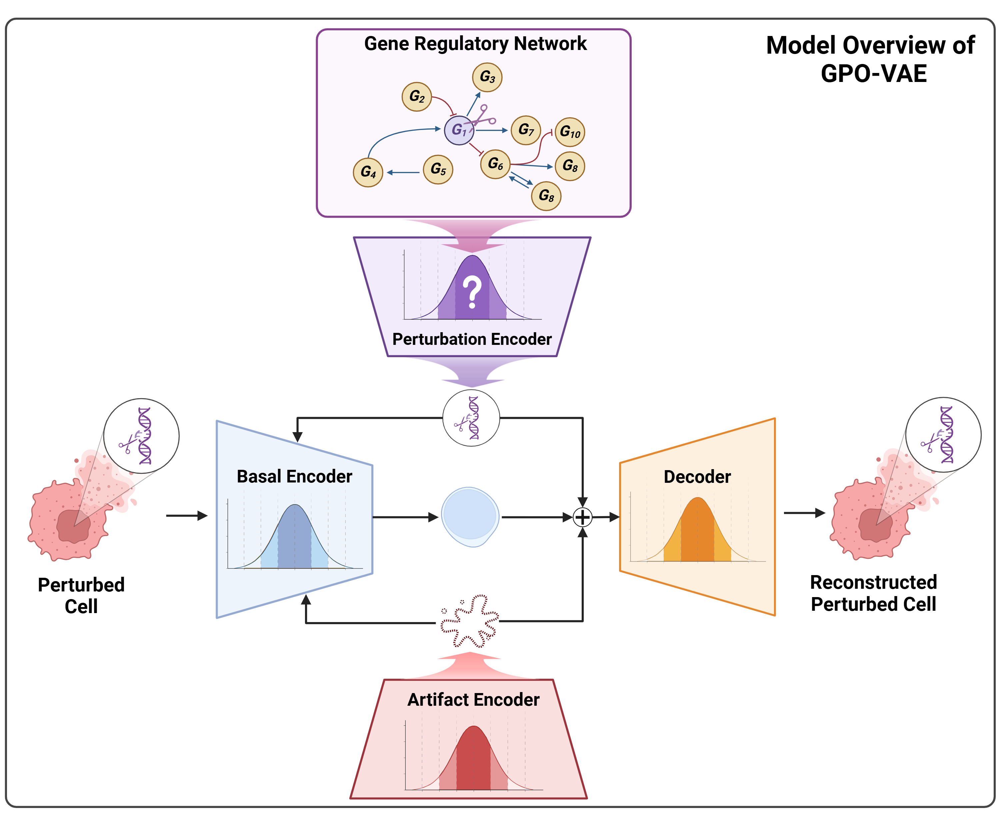

# GPO-VAE: Modeling Explainable Gene Perturbation Responses utilizing GRN-Aligned Parameter Optimization


## Abstract
Motivation: Predicting cellular responses to genetic perturbations is essential for understanding biological systems and developing targeted therapeutic strategies. While variational autoencoders (VAEs) have shown promise in modeling perturbation responses, their limited explainability poses a significant challenge, as the learned features often lack clear biological meaning. Nevertheless, model explainability is one of the most important aspects in the realm of biological AI. One of the most effective ways to achieve explainability is incorporating the concept of gene regulatory networks (GRNs) in designing deep learning models such as VAEs. GRNs elicit the underlying causal relationships between genes and are capable of explaining the transcriptional responses caused by genetic perturbation treatments.

Results: We propose GPO-VAE, an explainable VAE enhanced by GRN-aligned Parameter Optimization that explicitly models gene regulatory networks in the latent space. Our key approach is to optimize the learnable parameters related to latent perturbation effects towards GRN-aligned explainability. Experimental results on perturbation prediction show our model achieves state-of-the-art performance in predicting transcriptional responses across multiple benchmark datasets. Furthermore, additional results on evaluating the GRN inference task reveal our model's ability to generate meaningful GRNs compared to other methods. According to qualitative analysis, GPO-VAE posseses the ability to construct biologically explainable GRNs that align with experimentally validated regulatory pathways.

keywords: Gene Perturbation Response, Gene Regulatory Network, Explainable VAE, Causal Relationship


## How to run the experiments
### Prerequisites
This project is tested with following environments:
- Python: 3.9.19
- CUDA: 11.8
- Pytorch-lightning: 2.4.0
- Rapids-singlecell: 0.10.8
- Scanpy: 1.10.2
---
### Install environment (Linux)
```
conda env create --file environment.yml
conda activate gpo_vae_env
```
- If you encounter a conflict, run this command: `conda config --set channel_priority disabled`

```
pip install 'rapids-singlecell[rapids11]' --extra-index-url=https://pypi.nvidia.com #CUDA11.X
pip install 'rapids-singlecell[rapids12]' --extra-index-url=https://pypi.nvidia.com #CUDA12
```
- Install `rapids-singlecell` according to your CUDA version

```
pip install POT
```
- Install `POT` for preprocessing data

---
### Download datasets
If you want to annotated dataset when training our model,
```
pip install gdown
gdown https://drive.google.com/uc?id=1gpnjtKYLAsyGrPqGT8NbTcvx2tiLowXN # datasets(rpe1, k562, adamson)
gdown https://drive.google.com/uc?id=1C7vGxYqT-UvN1o_aYpVOcJXTDuJmH-lg # summary_stats_adamson.csv, summary_stats.xlsx
tar -zxvf datasets.tar.gz
tar -zxvf summary_stats.tar.gz
```
---
### Training models
The easiest way to train a model is specify a config file (eg `demo/gpo_vae_rpe1.yaml`) with data, model, and training hyperparameters
```
python train_rpe1.py --config ./demo/gpo_vae_rpe1.yaml
```
For larger experiments, we provide support for wandb sweeps using redun.
```
pip install redun
bash sweep_rpe1.sh
```
If you want to run a sweep, you should make the following changes in the `train_{data}.py` script:
- Change the argument defaults: `default=None`

---
## Acknowledgement
This code includes modifications based on the code of SAMS-VAE. We are grateful to the authors for providing their code/models as open-source software. And figure was created with BioRender.

## Contributors

<table>
	<tr>
		<th>Name</th>		
		<th>Affiliation</th>
		<th>Email</th>
	</tr>
	<tr>
		<td>Seungheun Baek&dagger;</td>		
		<td>Data Mining and Information Systems Lab,<br>Korea University, Seoul, South Korea</td>
		<td>sheunbaek@korea.ac.kr</td>
	</tr>
	<tr>
		<td>Soyon Park&dagger;</td>		
		<td>Data Mining and Information Systems Lab,<br>Korea University, Seoul, South Korea</td>
		<td>soyon_park@korea.ac.kr</td>
	</tr>
	<tr>
		<td>Yan Ting Chok</td>		
		<td>Data Mining and Information Systems Lab,<br>Korea University, Seoul, South Korea</td>
		<td>yanting1412@korea.ac.kr</td>
	</tr>
	<tr>
		<td>Mogan Gim*</td>		
		<td>Department of Biomedical Engineering,<br>Hankuk University of Foreign Studies, Yongin, South Korea</td>
		<td>gimmogan@hufs.ac.kr</td>
	</tr>
	<tr>
		<td>Jaewoo Kang*</td>		
		<td>Data Mining and Information Systems Lab,<br>Korea University, Seoul, South Korea</td>
		<td>kangj@korea.ac.kr</td>
	</tr>
</table>

- &dagger;: *Equal Contributors*
- &ast;: *Corresponding Author*